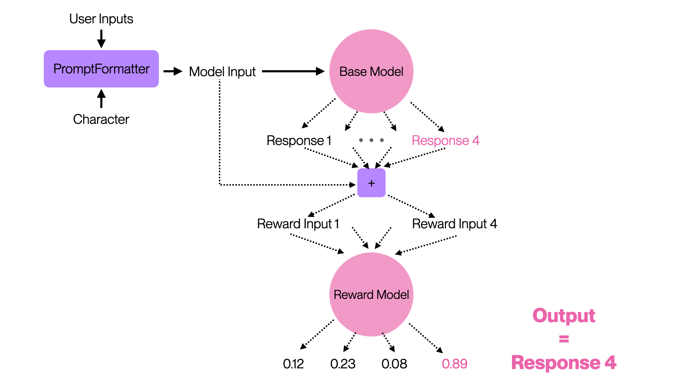

# Rewards Model Explained

* **Reward Modelling** is an essential part of making high-quality models.
* Best-of-N sampling is the main part of InstructGPT loop
* In fact, if you read the OpenAI's paper carefully, PPO out-of-the-box only achieves best-of-2 performance!
* Contrary to PPO (Proximal Policy Optimization), Best-of-N sampling is **simple**, **robust** and **high-performant**


In depth explanation


**Figure below shows the architecture for best-of-4 sampling with reward**

<figure><figcaption></figcaption></figure>

## Keep in mind these parameters

<figure><figcaption></figcaption></figure>
